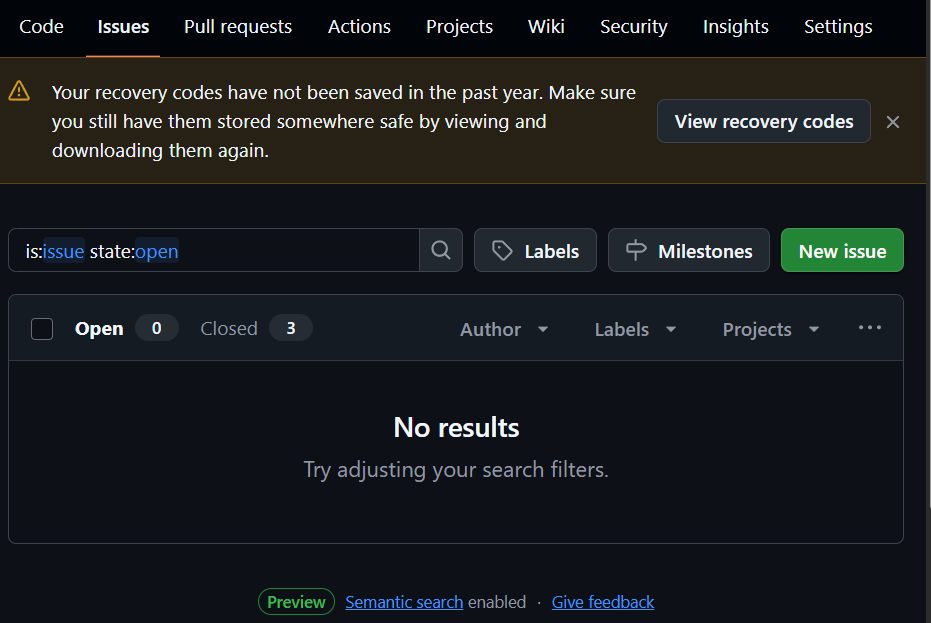
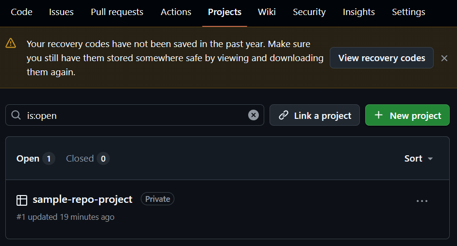
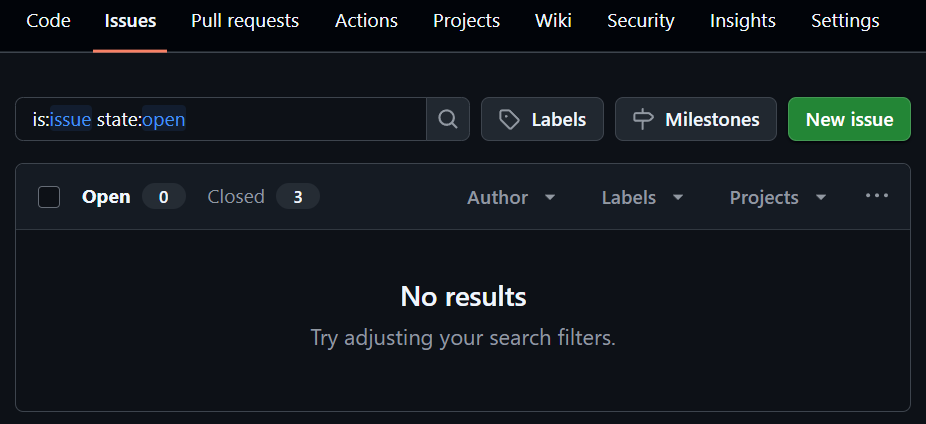
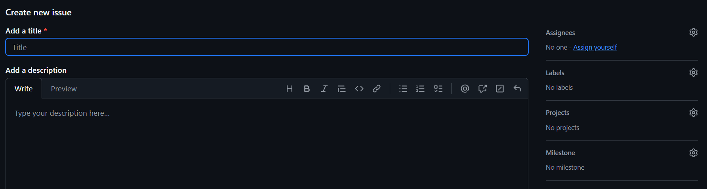
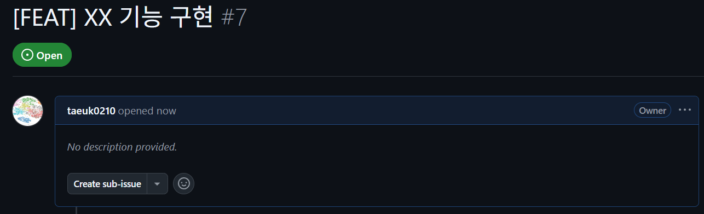

# GitHub Milestone, Project, Issue 활용 워크플로우

깃허브를 활용하여 프로젝트를 관리하는 방법을 정리한 문서입니다.

## 1. 초기 설정

### 1.1. Repository 생성

### 1.2. Milestone 생성
  

**마일스톤**은 기간, 배포 주기 등으로 작업(이슈)들을 묶을 때 사용합니다.  
repository -> Issues 탭 -> Milestones 버튼 클릭 후 새로운 마일스톤을 생성합니다. 이때 종료날짜를 입력하는 것을 추천  
- 네이밍 예시:  `v1.0.0`, `Sprint 1: 03/02~03/15 - 사용자 인증 및 회원가입`, `Phase 2: 결제 시스템 및 보안 강화`

### 1.3. Project 생성



**프로젝트**는 산산조각 난 이슈와 마일스톤들을 한눈에 보이게 정렬하여, 현재 전체적인 작업 진행 상황(진행 중, 대기 중, 완료)을 시각적으로 관리하기 위해 사용합니다.
repository -> Projects 탭 -> + New roject 버튼 클릭 후 새로운 프로젝트를 생성합니다.  
- 네이밍 예시:  `[비정형문서 정형화] Board`

## 2. 개발 워크플로우

### 2.1. Issue 생성



모든 작업은 이슈를 생성 후 수행합니다. repository -> Iusses 탭 -> New issue 버튼을 클릭하여 새로운 이슈를 생성합니다.



이슈 타이틀 컨벤션: `[타입] 제목` 또는 `타입: 제목`  
예시: 
- `[FEAT] 구글 소셜 로그인 기능 구현`
- `[BUG] 로그인 페이지 모바일 레이아웃 깨짐 수정`
- `[DOCS] README.md 설치 방법 업데이트`

**주요 타입**
| 타입 | 설명 |  
| --- | ---- |  
| `feat` | 새로운 기능 추가 |  
| `fix` | 버그 수정 |  
| `docs` | 문서 수정 (Markdown, 주석 등) |  
| `style` | 코드 포맷팅 (세미콜론 누락, 코드 변경 없는 포맷팅) |  
| `refactor` | 코드 리팩토링 |  
| `test` | 테스트 코드 추가/수정 |  
| `chore` | 빌드 업무 수정, 패키지 매니저 설정 등 (코드 변경 없음) |  

오른쪽 사이드바에서 **담당자**, **라벨**, **프로젝트**, **마일스톤**을 연결합니다.



이슈를 생성하면 위와 같이 이슈 번호를 확인할 수 있습니다. (**#7**)

### 2.2. 개발 브랜치 생성 및 작업 수행

IDE나 터미널에서 브랜치를 생성할 때 이슈 번호를 포함합니다.

```
git checkout -b feat/#7-xx
```

브랜치 네이밍 컨벤션: `타입/#이슈번호-간략한설명` (소문자 사용, 공백은 -로 대체)  
예시: 
- `feat/#1-google-login`
- `fix/#12-css-broken`
- `refactor/#5-api-optimization`

코드를 작성하고 커밋합니다. 이때 나중에 git log를 볼 때 무엇을 왜 했는지 한눈에 알 수 있도록 커밋 메세지를 작성합시다.

| 케이스 | 커밋 메세지 컨벤션 |  
| ----- | --------------- |  
| 본문이 필요 없는 짧은 커밋 | "타입: 제목 (#이슈번호)" |
| 상세 설명이 필요한 커밋 | "타입: 제목<br>본문 (상세 설명이 필요한 경우)<br>Fixes: #이슈번호" |

### 2.3. Pull Request(PR)과 이슈 연결

PR을 생성합니다. 
브라우저에서 GitHub 저장소(Repository) 페이지에 접속합니다.  
상단에 노란색 알림창으로 "Compare & pull request" 버튼이 자동으로 나타납니다. (방금 푸시한 브랜치가 보임)  
그 버튼을 누르고 제목과 내용을 작성한 뒤 리뷰어를 지정 후 Create pull request를 클릭합니다.
```markdown
## 개요
- 작업 목적 및 주요 변경 사항 (한 줄 요약)

## 작업 내용
- [ ] 기능 A 구현
- [ ] 기능 B 수정

## 스크린샷 (선택 사항)
- UI 변경이 있는 경우 첨부

## 이슈
- Closes #이슈번호 (필수로 넣어야 합니다.)
```

### 2.4. 리뷰어
4. Pull Request(PR) 본문 컨벤션
GitHub에서 PR을 보낼 때 설명란에 작성하는 내용입니다.

형식:

Markdown
중요: Closes #이슈번호를 적어야 머지 시 이슈가 자동 종료됩니다.